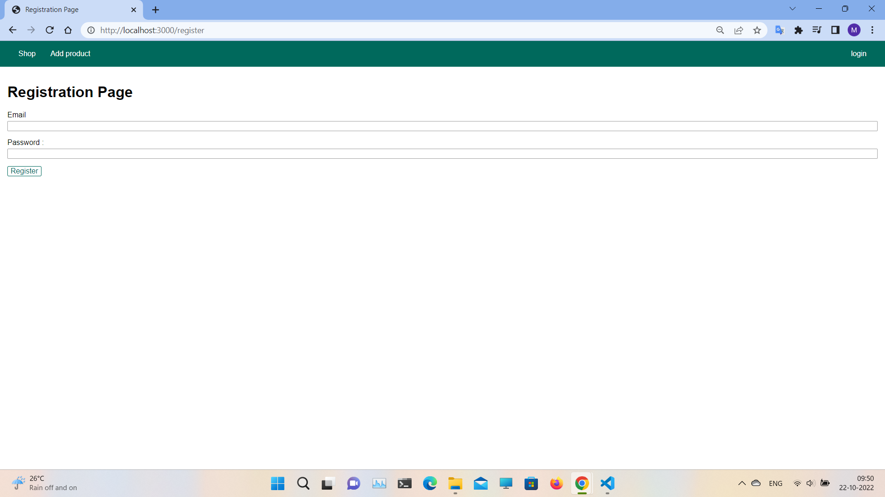
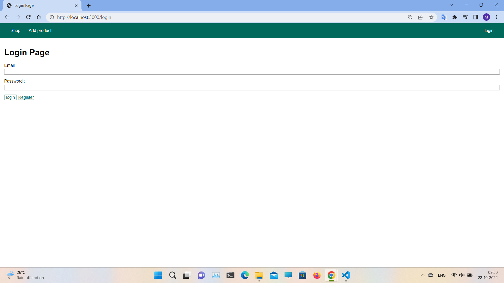
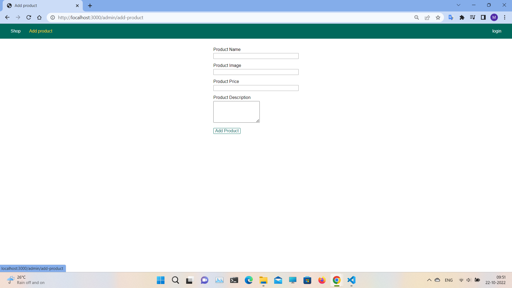
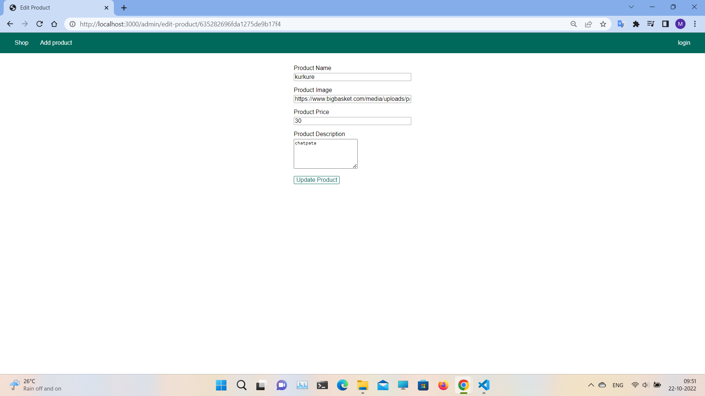
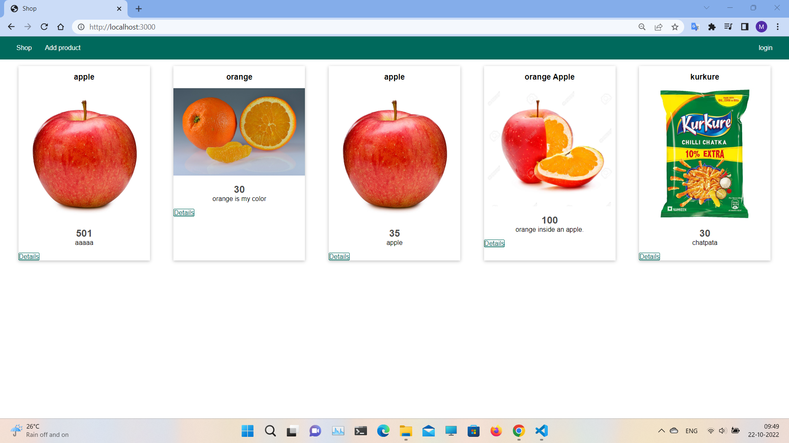
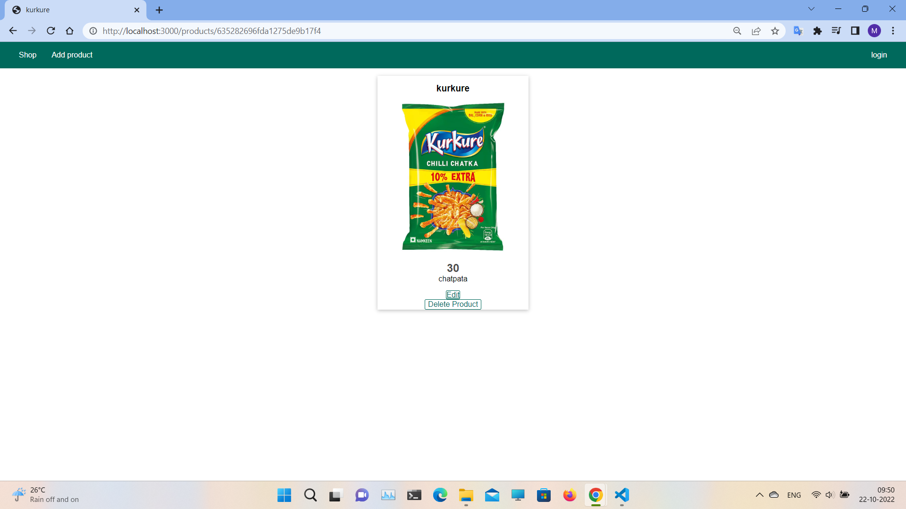

# A Shopping cart application build using Node.js, MongoDB & Express.js.

A web application where registered users can log-in and add/edit/delete products into the DB. The cloud based DB (MongoDB Atlas) stores users and products into collections titled "users" and "products". The user's login credentials (email and password) are cyphered with the help of bcrypt password-hashing function. The application is run using Node.js with the help of the back end framework Express.js 

The code for the application can be found at [WebDev-Node/nodemarch/nodeexpress/](https://github.com/manutv08/WebDev-Node/tree/master/nodemarch/nodeexpress) of this repository.


<!-- Latest compiled and minified CSS -->
<link rel="stylesheet" href="https://cdn.jsdelivr.net/npm/bootstrap@3.3.7/dist/css/bootstrap.min.css" integrity="sha384-BVYiiSIFeK1dGmJRAkycuHAHRg32OmUcww7on3RYdg4Va+PmSTsz/K68vbdEjh4u" crossorigin="anonymous">


## Sequence Diagram
The below figure shows the sequence diagram for the web application. It shows mainly how the Log-in process and CRUD operations of the application works.
```mermaid
sequenceDiagram
    participant web as Web Browser
    participant admin as Admin Services
    participant user as User Services
    participant shop as Shop Services
    participant db as MongoDB

    Note over web,db: The user must be logged in to add/edit/delete shopping cart items.
    web->>+user: Logs in using credentials
    user--)db: Search the user from "Users" collection
    db-->>user: Respond with query result

    alt Credentials not found
        user-->>web:Render Registration page.
    else Credentials found
        user->>-shop: Redirect to Home page
        shop -->>web: Render Home page

        Note over web,db: When the user is authenticated, they can now add/edit/delete shopping cart items 
        web->>+admin: Add new product
        admin--)db: Store product to "products" collection 
        admin->>-shop: Redirect to Home page 
        activate shop
        shop -->>web: Render Home page
        deactivate shop

        web->>+shop: Show details for an individual product
        shop--)db: Find the product from "products" collection
        db-->>shop: Respond with query result 
        shop->>-web: Render product_detail page

        web->>+admin: Edit a product
        admin--)db:  Find the product by Id and update
        admin->>-shop: Redirect to Home page 
        activate shop
        shop -->>web: Render Home page
        deactivate shop

        web->>+admin: Delete a product
        admin--)db:  Find the product by Id and Remove
        admin->>-shop: Redirect to Home page 
        activate shop
        shop -->>web: Render Home page
        deactivate shop

    web->>+user: Log out current user
    user->>user: Redirect to Login page
    user->>-web: Render Login page
    end

 ```
## Web application Screenshots
The below figures displays the screenshots of the web application
 <div class="row">
<div class="col-md-6">
<figure>
      
      <figcaption style="text-align:center;">Fig.1 Registration Page.</figcaption>
</figure>
</div>

<div class="col-md-6">
<figure>
      
      <figcaption style="text-align:center;">Fig.2 Login Page.</figcaption>
</figure>
</div>


<div class="col-md-6">
<figure>
      
      <figcaption style="text-align:center;">Fig.3 Add Product Page.</figcaption>
</figure>
</div>

<div class="col-md-6">
<figure>
      
      <figcaption style="text-align:center;">Fig.4 Edit Product Page.</figcaption>
</figure>
</div>

<div class="col-md-6">
<figure>
      
      <figcaption style="text-align:center;">Fig.5 Edit Product Page.</figcaption>
</figure>
</div>

<div class="col-md-6">
<figure>
      
      <figcaption style="text-align:center;">Fig.6 Product Details Page.</figcaption>
</figure>
</div>

</div>